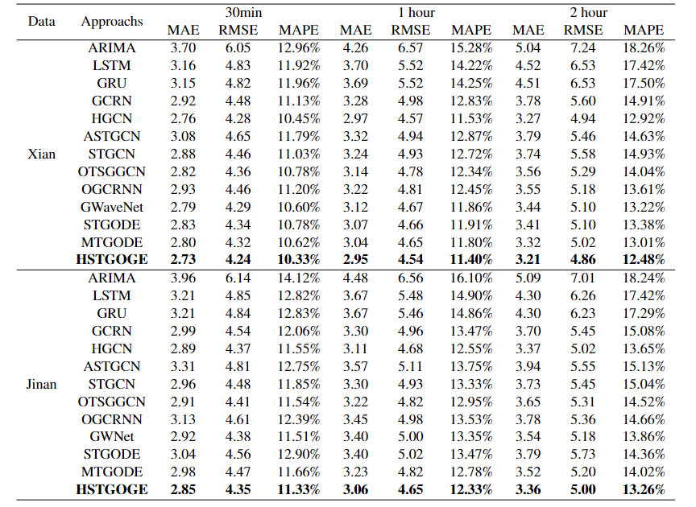

***First, the structure of the code:

util.py: The reading of data and other functions except of Model

utils.py: all base blocks and functions of neural network models in our paper

model.py: construct model based on utils.py

engine.py: the program of training model in our paper

train.py: compared models 

train_h.py: HSTGODE

***How to run these files?

In jupyter ,you should write:

run train.py --model (you can select, such as gwnet) --force True

or 

run train_h.py --model (you can select, such as HSTGODE) --force True

If you want to change the dataset from XiAn_city to JiNan_city, I suggest you can directly revise the code in your IDE in train.py or train_h.py

if you want get the dataset from XiAn_city to JiNan_city. 

the hstgode result can be seen as follow;

